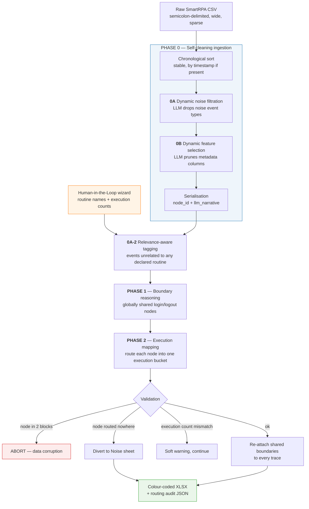

<div align="center">

# Segmentation of User Interface Logs for Robotic Process Automation with Shared-Action Routines: A Semi-Supervised LLM-Based Approach

**A three-stage, semi-supervised pipeline that reconstructs discrete RPA executions
from a single, noisy, interleaved user-interaction log.**

[](https://www.python.org/)
[](https://ai.google.dev/)
[](#7-testing)
[](#5-datasets)

</div>

---

> **Thesis project** — *Master thesis, Engineering in Computer Science*
> Author: Leonardo Ricca · Supervisor: Andrea Marrella, Andrea Agostinelli · Sapienza Università Di Roma, 2026.

---

## Table of contents

1. [The problem](#1-the-problem)
2. [The approach](#2-the-approach)
3. [Architecture](#3-architecture)
4. [Repository layout](#4-repository-layout)
5. [Datasets](#5-datasets)
6. [Quickstart](#6-quickstart)
7. [Testing](#7-testing)
8. [Output format](#8-output-format)
9. [Engineering notes](#9-engineering-notes)
10. [Cost and observability](#10-cost-and-observability)
11. [Design decisions and limitations](#11-design-decisions-and-limitations)
12. [Reproducibility](#12-reproducibility)

---

## 1. The problem

Robotic Process Automation starts from a **UI log**: a flat, chronological dump of
every action a human performed at the interface — clicks, navigations, copies,
pastes, keystrokes. Process-mining tools can learn a routine from such a log, but
only if the log contains *one clean routine at a time*.

Real logs do not. A single recording session typically contains:

| Difficulty | What it looks like in the log |
| :-- | :-- |
| **Multiple routines** | "Approve Loan" and "Issue Card" recorded in the same session |
| **Multiple executions** | The same routine repeated four times with different payloads |
| **Interleaving** | The user switches routine mid-way; events of A and B alternate |
| **Shared boundaries** | A single login at the start and one logout at the end serve *every* routine |
| **Semantic noise** | Mouse moves, hovers, scrolls, zoom changes, window focus events |
| **Contextual noise** | Real clicks in applications unrelated to the task (a chat app, a music player) |
| **Payload-less actions** | A bare `click: Submit` that carries no clue about which execution it closes |

Segmenting this by hand is the bottleneck. Segmenting it with rules fails because
the cues are **semantic**, not structural: knowing that `crm/billing → paste REF-801`
and a later `click: Confirm` belong to the *same* refund requires understanding what
the actions mean.

This project asks whether a **generative LLM**, constrained by a small amount of
human knowledge, can do that segmentation reliably enough to be useful.

---

## 2. The approach

The pipeline is **semi-supervised**: the human is not asked to label events, only to
declare *what should be there*. That declaration — the **Oracle constraint** — is
collected once by an interactive wizard at startup:

```
How many distinct business routines are in this log? 2
 -> Short name for Routine 1: Approve Loan
 -> How many times was 'Approve Loan' executed? 4
 -> Short name for Routine 2: Issue Card
 -> How many times was 'Issue Card' executed? 4
```

Everything else is inferred by the model. Three ideas carry the design:

**① Decompose the reasoning.** Asking one prompt to "segment this log" fails: the
model must simultaneously filter noise, recognise routines, and count executions.
The work is therefore split into successive phases, each with a narrow question and
a schema-constrained answer.

**② Remove the gravity well first.** Actions shared by *all* routines (the login,
the logout) attract every segmentation hypothesis and blur the boundaries between
routines. Phase 1 isolates them **before** routing, so Phase 2 reasons only about
genuinely routine-specific events. The shared boundaries are re-attached to every
reconstructed trace afterwards — each trace stays individually replayable.

**③ Translate structure into language.** A wide, sparse CSV row is not something an
LLM reads well. Every row is serialised into one anchored sentence built only from
business-relevant columns:

```
[APP: Chrome] action: paste | browser_url: https://bank.intra/loans | clipboard_content: REF-801
```

---

## 3. Architecture



### The phases in detail

<table>
<tr><th align="left">Phase</th><th align="left">Question asked</th><th align="left">Failure policy</th></tr>

<tr valign="top"><td><b>0A</b><br/><sub>Noise filtration</sub></td>
<td>Given the inventory of <code>event_type</code> values and their frequencies, which types are
<i>semantic noise</i> — mouse moves, hovers, scrolls, focus changes?<br/>
Nothing is hard-coded: the model is shown the actual event vocabulary of the log, so the
pipeline stays vendor-agnostic.</td>
<td><b>Fail-open.</b> On any API error the original frame is returned untouched. Keeping too
many rows is recoverable; silently dropping real actions is not.</td></tr>

<tr valign="top"><td><b>0B</b><br/><sub>Feature selection</sub></td>
<td>Which <i>columns</i> are pure system metadata (timestamps, GUIDs, window sizes, screenshot
paths) versus business context (URLs, button text, clipboard content)?<br/>
Each column is presented with up to three <i>distinct, non-empty</i> samples — critical on
sparse logs where the first cell of a meaningful column is usually blank.</td>
<td><b>Fallback list.</b> On API error a conservative hard-coded metadata list is used.
<code>application</code> and <code>event_type</code> are anchors and are never pruned.</td></tr>

<tr valign="top"><td><b>0A-2</b><br/><sub>Relevance tagging</sub></td>
<td>Given the routine names the human declared, which events belong to <i>none</i> of them?<br/>
This catches noise that survives type-based filtering because it shares an event type with
real work — a genuine click, but in Spotify or Slack. Relevance is judged <i>relative to the
declared routines</i>, so the same Slack event is noise for an ERP log and signal for a
"reply to customer" log.<br/>
A <b>payload guard</b> protects any node whose narrative carries a distinctive token — one
appearing on at most two nodes. Real payloads (record ids, pasted values) are rare by
definition; generic repeated labels are not. This prevents false-positive noise tagging
from discarding signal.</td>
<td><b>Fail-open.</b> On API error nothing is tagged, exactly reproducing the pre-upgrade
behaviour. Tagged nodes are never deleted — only diverted for review.</td></tr>

<tr valign="top"><td><b>1</b><br/><sub>Boundary reasoning</sub></td>
<td>Which nodes are <i>globally shared</i> boundaries — setup every routine depends on, teardown
that closes the whole session?<br/>
The response schema lists <code>reasoning</code> <i>before</i> <code>shared_indices</code>, which forces the model to
commit to an argument before committing to numbers. A worked example in the prompt teaches
the key distinction: a first action already carrying routine-specific payload is the first
step of one routine, not a shared boundary.</td>
<td><b>Fail-fast on API error</b> (returns <code>None</code>, the orchestrator aborts).
Hallucinated node ids are a different matter: they are dropped with a warning, not treated
as a crash.</td></tr>

<tr valign="top"><td><b>2</b><br/><sub>Execution mapping</sub></td>
<td>Distribute the remaining nodes into <i>exactly</i> the execution buckets the Oracle declared.
The routine name is the semantic anchor: meaning decides <i>which routine</i>; payload
continuity and chronology decide <i>which execution</i>. Payload-less actions attach to the
execution whose preceding payload they logically complete.</td>
<td><b>Layered.</b> A node in two blocks is fatal — real corruption, abort. A node routed
nowhere is diverted to the Noise sheet with a loud warning. An execution-count mismatch
against the Oracle is a soft warning: output is still produced, and the discrepancy is
visible to the operator.</td></tr>
</table>

> **Nothing is ever silently lost.** Every input event ends up either in a reconstructed
> trace or in the reviewable `Noise` sheet of the workbook.

---

## 4. Repository layout

```
thesis_project/
│
├── src/                              # Pipeline source — no file imports another by path
│   ├── main.py                       # Orchestrator + Human-in-the-Loop wizard + CLI
│   ├── data_pipeline.py              # Ingestion, Phase 0A / 0B / 0A-2, serialisation
│   ├── phase1_boundary_reasoning.py  # Phase 1 — globally shared boundaries
│   ├── phase2_execution_mapping.py   # Phase 2 — routing, validation, XLSX + JSON export
│   ├── smart_llm_client.py           # Gemini REST client: cache, telemetry, retry/back-off
│   └── analyze_telemetry.py          # Token/cost observability report
│
├── tests/                            # 40 pytest cases — fully offline
│   ├── test_pipeline_phases.py       # Phases driven by a scripted stub client
│   └── test_smart_llm_client.py      # Client driven by an injected fake transport
│
├── data/                             # Evaluation logs, ordered by experimental stage
│   ├── 01_pilot/                     # Stage 1 — small logs, internal portal scenario
│   ├── 02_interleaving/              # Stage 2 — CRM scenario, increasing interleaving
│   ├── 03_stress/                    # Stage 3 — 50–69 events, multi-application
│   └── 04_noise/                     # Stage 4 — noise injection, up to 193 events
│
├── results/                          # Reference artefacts from a real run (committed)
│   ├── Final_Segmented_Master_Log.xlsx
│   ├── Final_Segmented_Master_Log_routing.json
│   ├── gemini_cache.json             # Cached LLM responses — enables a zero-cost replay
│   ├── token_telemetry.csv
│   └── token_telemetry_old.csv
│
├── .env.example                      # Template for the API key — copy to .env
├── .gitignore                        # .env and runtime artefacts stay out of the repo
├── pytest.ini                        # pythonpath=src, so tests import modules unchanged
├── requirements.txt
└── README.md
```

> **Note on the layout.** Source files were relocated into `src/` with no change to any
> logic. `pytest.ini` declares `pythonpath = src`, so the test suite imports
> `data_pipeline`, `phase1_boundary_reasoning`, … by plain module name exactly as it did
> when everything sat in the project root. The only line touched in the sources was the
> default sample-log path in `main.py`, updated to point at the file's new location.
>
> The move is verified end to end: replaying the reference run against the committed
> response cache reproduces `results/Final_Segmented_Master_Log.xlsx` and its routing JSON
> identically, with zero network calls.

---

## 5. Datasets

All logs follow the **SmartRPA** export format: semicolon-delimited and highly sparse —
49 columns, of which typically 8–15 ever hold a value. They instantiate the interleaving
scenarios of the **RCIS-2021 Case 3.x** benchmark family, and are ordered here by the
stage of the study in which they were used.

| Stage | File | Events | Applications | What it probes |
| :-- | :-- | --: | :-- | :-- |
| **01 · pilot** | `test_case3.1` … `3.4.csv` | 14 | Chrome, Clipboard | Baseline feasibility: two short routines on an internal portal, copy/paste payloads, progressively interleaved |
| **02 · interleaving** | `test2_case3.1` … `3.4.csv` | 10 | Chrome | Fixed length, rising interleaving: `3.1` is block-sequential, `3.4` alternates routines event by event. Isolates interleaving as the single variable |
| **03 · stress** | `stress_case3_1` … `3_4.csv` | 50 | Chrome | Scale: four executions per routine, long-range payload continuity |
| | `stress2_case3_4.csv` | 69 | Chrome, Excel, Citrix, CardTool | Cross-application routines and desktop events, not just browser navigation |
| **04 · noise** | `test_noise_case.csv` | 19 | Chrome | Minimal noise-filtration case: mouse moves and hovers interleaved with real actions. Uses a reduced 10-column schema, which also verifies that Phase 0B generalises beyond the full SmartRPA header |
| | `hard_case3_4_noisy.csv` | 193 | Chrome, Spotify, Slack | The hard case: heavy `mouseMove`/`scroll`/`zoomChange`/`resizeWindow` noise **plus** genuine events in unrelated applications — the scenario Phase 0A-2 exists for |

<details>
<summary><b>Mapping from the original flat filenames</b> (for traceability against the thesis text)</summary>

| Original path | Current path |
| :-- | :-- |
| `test1/test_case3.{1..4}.csv` | `data/01_pilot/test_case3.{1..4}.csv` |
| `test2/test2_case3.{1..4}.csv` | `data/02_interleaving/test2_case3.{1..4}.csv` |
| `stress_case3_{1..4}.csv` | `data/03_stress/stress_case3_{1..4}.csv` |
| `stress2_case3_4.csv` | `data/03_stress/stress2_case3_4.csv` |
| `test2/test_noise_case.csv` | `data/04_noise/test_noise_case.csv` |
| `hard_case3_4_noisy.csv` | `data/04_noise/hard_case3_4_noisy.csv` |

File contents are byte-identical to the originals; only their location changed.
</details>

---

## 6. Quickstart

### Install

```bash
git clone <repository-url>
cd thesis_project

python -m venv .venv
# Windows:  .venv\Scripts\activate
# macOS/Linux:  source .venv/bin/activate

pip install -r requirements.txt
```

### Configure

```bash
cp .env.example .env      # Windows: copy .env.example .env
```

Then open `.env` and paste your key from [Google AI Studio](https://aistudio.google.com/apikey):

```ini
GEMINI_API_KEY=your_key_here
GEMINI_MODEL=gemini-2.5-flash
```

> `.env` is git-ignored. The model is environment-driven, so switching to
> `gemini-2.5-flash-lite` for a high-request-per-day stress run needs no code change.

### Run

```bash
python src/main.py data/04_noise/test_noise_case.csv
```

> The path argument is optional: omitted, it defaults to
> `data/04_noise/test_noise_case.csv`, resolved against the repository root so it works
> from any working directory.

The wizard asks for the routines and their execution counts, then the pipeline runs
end to end. Two files are written **to the current working directory**:

- `Final_Segmented_Master_Log.xlsx` — the colour-coded segmented log
- `Final_Segmented_Master_Log_routing.json` — the routing audit trail

Useful flags:

```bash
# Disable Phase 0A-2 relevance tagging, reproducing the pre-upgrade behaviour
python src/main.py data/03_stress/stress2_case3_4.csv --no-relevance-filter

# Token and cost report for the last run
python src/analyze_telemetry.py

# Report against a stored telemetry file, with custom pricing
python src/analyze_telemetry.py results/token_telemetry.csv --input-price 0.30 --output-price 2.50
```

### Use as a library

```python
from smart_llm_client import SmartLLMClient
from data_pipeline import load_and_serialize_smartrpa, tag_irrelevant_nodes
from phase1_boundary_reasoning import identify_shared_boundaries
from phase2_execution_mapping import generate_segmented_log

MODEL = "gemini-2.5-flash"
client = SmartLLMClient()                      # one client: one cache, one telemetry log

constraints = [{"routine_name": "Approve Loan", "executions": 4}]

df = load_and_serialize_smartrpa("log.csv", MODEL, client)          # Phase 0 / 0A / 0B
df = tag_irrelevant_nodes(df, ["Approve Loan"], MODEL, client)      # Phase 0A-2
shared = identify_shared_boundaries(df, MODEL, client)              # Phase 1
generate_segmented_log(df, shared, constraints, MODEL, client=client)  # Phase 2
```

---

## 7. Testing

```bash
pytest
```

**40 tests, no network access.** `SmartLLMClient` exposes an injectable `_transport`
and `sleep`, so HTTP behaviour — retry on 429/5xx, exhaustion, malformed envelopes,
blocked prompts, markdown-fenced JSON, cache hits, telemetry rows — is exercised
deterministically against a fake transport. The phase tests drive the pipeline with a
scripted stub client that returns queued responses and records the prompts it received,
so prompt construction itself is under test.

---

## 8. Output format

### `Final_Segmented_Master_Log.xlsx`

**Sheet `Segmented_Logs`** — every original column, preceded by two new ones:

| `routine_name` | `trace_id` | `timestamp` | `application` | `event_type` | … |
| :-- | :-- | :-- | :-- | :-- | :-- |
| Approve Loan | `Approve Loan_exec1` | … | Chrome | navigateTo | … |

Each row is filled with a colour that is a **pure function of (routine, execution)**:
a distinct base hue per routine, lightness varied across that routine's executions and
clamped to a legible 0.35–0.85 band. The same input therefore always produces the same
figure — reproducible screenshots for the thesis. The header row is frozen, autofilter
is on, and column widths are fitted.

**Sheet `Noise`** — present only when something was diverted: nodes tagged as unrelated
by Phase 0A-2, plus any node the router declined to place. This sheet is the human
review queue.

### `Final_Segmented_Master_Log_routing.json`

The full routing plan, including the model's per-execution `reasoning` string, plus the
list of diverted node ids. This is the audit trail: it shows *why* each execution was
assembled the way it was.

<details>
<summary><b>Reference run</b> — <code>data/03_stress/stress2_case3_4.csv</code></summary>

Four routines × four executions, reconstructed from 69 interleaved cross-application
events:

| Routine | Executions | Nodes per execution |
| :-- | --: | --: |
| Reconcile Account | 4 | 3 |
| Post Journal | 4 | 4 |
| Issue Card | 4 | 4 |
| Approve Loan | 4 | 5 |

The exported workbook holds 144 rows across 16 traces — more than the 69 input events,
because the globally shared boundaries identified in Phase 1 are re-attached to each of
the 16 reconstructed traces so that every trace is independently replayable.

</details>

---

## 9. Engineering notes

The client (`src/smart_llm_client.py`) is a deliberately small REST wrapper rather than
the vendor SDK. Four properties matter for a thesis pipeline:

| Property | Implementation |
| :-- | :-- |
| **Deterministic output** | Every call is constrained by a Gemini `responseSchema`; no free-text parsing. Markdown code fences are stripped before `json.loads` as a belt-and-braces measure. |
| **Zero-cost repetition** | An MD5 fingerprint of `model ⨯ system prompt ⨯ user prompt ⨯ schema ⨯ thinking budget` keys an on-disk JSON cache. `sort_keys=True` makes the schema fingerprint order-independent, so semantically identical schemas share a cache entry. Writes are atomic (temp file + `os.replace`), so an interrupted run cannot corrupt the cache. |
| **Resilience** | Bounded exponential back-off on 429 and 5xx (4 attempts, 2 → 4 → 8 → 16 s) with a per-request timeout. This became necessary after the free-tier quota reductions of December 2025. Non-retryable statuses fail immediately with the status attached. |
| **Observability** | Every live call appends a row to `token_telemetry.csv` via the `csv` module, so payloads containing commas or quotes cannot corrupt the file. |

Two further details worth noting for the thesis:

- **Thinking budget is opt-in.** It defaults to `0` — off. Phases 0A and 0B are simple
  classification tasks and run with no internal thinking, which is faster and cheaper.
  Phases 1 and 2 request a budget of 512 tokens. Because the budget is part of the cache
  key, a reasoning-enabled call can never silently reuse a no-reasoning cached answer.
- **`node_id` is a stable column, not the pandas index.** Every phase addresses nodes by
  this identifier, so the LLM's view of the log and the reconstruction logic stay aligned
  across the filtering and reordering that Phase 0 performs.

---

## 10. Cost and observability

```bash
python src/analyze_telemetry.py results/token_telemetry.csv
```

```
=================================================
 LLM TELEMETRY & OBSERVABILITY REPORT
=================================================
Total API Calls Made:   36
Total Input Tokens:     118,925
Total Output Tokens:    18,189
Total Overall Tokens:   146,118
-------------------------------------------------
Avg Input per Call:     3,303 tokens
Avg Output per Call:    505 tokens
-------------------------------------------------
Estimated Cost:         $0.08115 USD (@ $0.3/M in, $2.5/M out)
=================================================
```

The full experimental campaign recorded in `results/token_telemetry.csv` cost **under
ten cents** — cache hits are not billed and are not logged, so the figure reflects live
calls only. Prices are CLI-configurable for other models.

---

## 11. Design decisions and limitations

**Why a human Oracle at all?** Because the number of executions is genuinely
unrecoverable from an interleaved log in the general case: two consecutive refunds and
one refund retried after an error are indistinguishable at the UI level. Supplying that
count turns an ill-posed problem into a well-posed one, and it is knowledge an analyst
already has. The Oracle count is enforced *softly* — a mismatch is reported rather than
forced, so the discrepancy stays visible as evidence instead of being hidden by the
pipeline.

**Payload-less interleaving is the boundary of the method.** When many events serialise
to identical narratives — a long run of generic `click: Submit` with no distinguishing
URL, text, or clipboard content — nothing in the log tells the model which execution a
given click completes. Rather than fail silently, Phase 0 counts distinct narratives and
prints an explicit warning when fewer than half the events are distinguishable, so the
operator knows Phase 2 is operating at risk before reading its output.

**Known constraints.**

- The Excel exporter is tuned for logs of the size studied here; very large logs would
  need a streaming writer.
- Phases 0A-2, 1 and 2 each send the whole serialised log in one prompt, so the practical
  input size is bounded by the model's context window.
- Results depend on the model version. `gemini-2.5-flash` is the default; the committed
  cache pins the exact responses behind the reported results.

---

## 12. Reproducibility

The `results/` directory is a snapshot of a real run, committed on purpose.

**Replaying the reference run without spending anything:** the pipeline looks for its
cache in the current working directory. Copy the committed cache there first —

```bash
cp results/gemini_cache.json .
python src/main.py data/03_stress/stress2_case3_4.csv
```

— and declare the same routines and counts in the wizard (Reconcile Account, Post
Journal, Issue Card, Approve Loan; four executions each). Every request then resolves
against the cache, the console prints `[CACHE HIT]` throughout, and no API call is made.

Changing any prompt, schema, model, or input file changes the fingerprint and triggers a
live call — which is the point: the cache can never mask a change.

---

<div align="center">
<sub>Master thesis · Sapienza Università di Roma, 2026 · Segmenting interleaved RPA UI logs with generative LLMs</sub>
</div>
