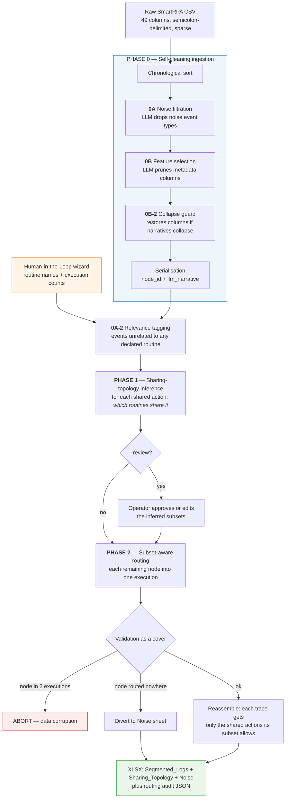

<div align="center">

# Segmentation of UI Logs for RPA with Shared-Action Routines

**A semi-supervised, LLM-based pipeline that untangles a single interleaved user-interaction
log into discrete robot executions — including when routines *share* actions only partially.**

[](https://www.python.org/)
[](https://ai.google.dev/)
[](#11-testing)
[](#5-the-case-study)

</div>

---

> **Master thesis** — *Engineering in Computer Science*
> Author: **Leonardo Ricca** · Supervisors: **Andrea Marrella**, **Andrea Agostinelli**
> Sapienza Università di Roma, 2026
>
> This repository contains the implementation, the case-study logs, and the artefacts
> behind every result reported in **Chapter 7** of the thesis.

---

## Table of contents

1. [The problem](#1-the-problem) · 2. [What this work adds](#2-what-this-work-adds) · 3. [Architecture](#3-architecture)
4. [Repository layout](#4-repository-layout) · 5. [The case study](#5-the-case-study) · 6. [Quickstart](#6-quickstart)
7. [Reported results](#7-reported-results) · 8. [Reproducing them](#8-reproducing-them) · 9. [Output format](#9-output-format)
10. [Engineering notes](#10-engineering-notes) · 11. [Testing](#11-testing) · 12. [Cost and provenance](#12-cost-and-provenance)
13. [Limitations](#13-limitations)

---

## 1. The problem

Robotic Process Automation starts from a **UI log**: a flat, chronological record of what a
human did at the interface — clicks, navigations, copies, pastes, keystrokes. A process-mining
tool can learn a routine from such a log, but only if the log contains one clean routine at a time.

A real recording session does not. It contains several business routines, each executed more
than once, **interleaved** — and it contains actions that belong to more than one of them.

Segmenting that by hand is the bottleneck. Segmenting it with rules fails, because the cues are
**semantic** rather than structural: deciding that a navigation to `/acquisti/anagrafica-percipienti`
belongs to *both* the purchasing routine *and* the grant routine requires understanding what
those routines are for.

## 2. What this work adds

Prior approaches assume that shared actions are shared by **every** routine — a single login at
the start, a single logout at the end. The thesis calls this assumption **A1** and relaxes it to
**A1′**: an action may be shared by an arbitrary **subset** of the routines.

That relaxation is the difference between a boundary-detection problem and a **topology-inference**
problem. Phase 1 no longer returns a list of globally shared nodes; it returns, for each shared
action, *which routines share it*. A trace is then reassembled with exactly the shared actions its
own subset entitles it to — no more, no less.

The pipeline is **semi-supervised**. The human is never asked to label events, only to declare
what should be there — the **Oracle constraint**, collected once by a wizard at startup:

```
How many distinct business routines are in this log? 4
 -> Short name for Routine 1: Travel Authorization
 -> How many times was 'Travel Authorization' executed? 2
 ...
```

Everything else is inferred. A wide, sparse CSV row is not something a language model reads well,
so every row is serialised into one anchored sentence built only from business-relevant columns:

```
[APP: Chrome] action: navigateTo | category: Browser | browser_url: https://amm.diag.uniroma1.it/auth
```

---

## 3. Architecture



| Phase | Question asked | Failure policy |
| :-- | :-- | :-- |
| **0A** | Which `event_type` values are semantic noise (mouse moves, hovers, scrolls, focus changes)? The model is shown the log's actual event vocabulary, so nothing is hard-coded. | **Fail-open** — on API error the frame is returned untouched. Keeping too many rows is recoverable; dropping real actions is not. |
| **0B** | Which *columns* are pure system metadata rather than business context? Each column is shown with up to three distinct, non-empty samples — critical on sparse logs. | **Fallback list** on API error. `application` and `event_type` are anchors and are never pruned. |
| **0B-2** | Did pruning make distinct events serialise to identical text? The guard measures that collapse and restores the minimum set of columns that separates them again. | Local computation, no API call. |
| **0A-2** | Given the declared routine names, which events belong to *none* of them? Catches noise that survives type-based filtering — a genuine click, but in an unrelated application. A **payload guard** protects any node carrying a distinctive token, so real payloads are never diverted. | **Fail-open** — on API error nothing is tagged. Tagged nodes are diverted for review, never deleted. |
| **1** | For each candidate shared action, **which subset of routines** shares it? Reasoning is emitted before the answer, so the model commits to an argument before committing to a set. | **Fail-fast** on API error. Hallucinated node ids are dropped with a warning rather than treated as a crash. |
| **2** | Distribute the remaining nodes into exactly the execution buckets the Oracle declared, using routine meaning for *which routine* and payload continuity for *which execution*. | **Layered** — a node in two executions is fatal (abort); a node routed nowhere is diverted to the Noise sheet; an Oracle-count mismatch is a warning that still produces output. |

> **Nothing is ever silently lost.** Every input event ends up either in a reconstructed trace or
> in the reviewable `Noise` sheet.

---

## 4. Repository layout

```
.
├── src/
│   ├── main.py                       # Orchestrator, Oracle wizard, --review flow, CLI
│   ├── data_pipeline.py              # Ingestion, Phase 0A / 0B / 0B-2 / 0A-2, serialisation
│   ├── phase1_boundary_reasoning.py  # Phase 1 — sharing-topology inference (A1')
│   ├── phase2_execution_mapping.py   # Phase 2 — subset-aware routing, validation, export
│   ├── smart_llm_client.py           # Gemini REST client: cache, telemetry, retry, budget translation
│   ├── analyze_telemetry.py          # Token/cost observability report
│   ├── phase1_repeat.py              # Repeatability harness for Phase 1  (thesis 7.4)
│   └── phase2_repeat.py              # Repeatability harness for Phase 2  (thesis 7.3)
│
├── tests/                            # 40 pytest cases — fully offline
│
├── data/
│   ├── case_study/                   # The two logs of thesis Table 6.2
│   │   ├── caso_studio_trasferte_2exec.csv        # primary artefact, 114 rows
│   │   └── caso_studio_trasferte_2exec_hard.csv   # A3-degraded variant (6.10)
│   └── exploratory/                  # Preliminary logs, not cited in Chapter 7
│
├── results/
│   ├── case_study/                   # The artefacts behind Chapter 7
│   │   ├── Final_Segmented_Master_Log.xlsx
│   │   ├── Final_Segmented_Master_Log_routing.json
│   │   ├── token_telemetry.csv       # reproduces Table 7.9 exactly — see section 12
│   │   └── gemini_cache.json         # cached responses for Phases 0-1
│   └── exploratory/                  # Outputs of the preliminary runs, not cited
│
├── .env.example · .gitignore · pytest.ini · requirements.txt · README.md
```

`pytest.ini` declares `pythonpath = src`, so the tests import `data_pipeline`,
`phase1_boundary_reasoning`, … by plain module name.

---

## 5. The case study

The evaluation uses a purpose-built administrative case study: four routines of a university
department, recorded in one browser session, **interleaved**, with **two executions each** and
realistic noise. It instantiates **Case 3.4** — the hardest interleaving class — *and* partial
sharing, which is what the thesis set out to test.

| Routine | Starts from | Shares with |
| :-- | :-- | :-- |
| **Travel Authorization** | webmail request | login/logout, webmail opener |
| **Expense Reimbursement** | webmail request | login/logout, webmail opener, accounting prerequisite |
| **Purchase Order Approval** | webmail request | login/logout, webmail opener, procurement opener |
| **Student Grant Disbursement** | an internal portal notice, *not* an email | login/logout, procurement opener |

That last row is the design decision that makes the case study work: because R4 does not start
from an email, the webmail opener is a genuine **three-of-four subset** rather than a global
prerequisite. The ground-truth topology therefore contains a 4/4 subset, a 3/4, a 2/4 and a
single-routine prerequisite — every subset size the relaxed assumption allows.

| File | Rows | Business events | Noise | Case |
| :-- | --: | --: | :-- | :-- |
| `caso_studio_trasferte_2exec.csv` | 114 | 98 | 8 events | 3.4 + partial sharing |
| `caso_studio_trasferte_2exec_hard.csv` | 114 | 98 | 8 events | 3.4, one dependency's lexical trace removed |

Both follow the SmartRPA schema: 49 columns, semicolon-delimited, extremely sparse — only 18
columns are ever populated, and only five carry a value on every row.

---

## 6. Quickstart

```bash
git clone <repository-url> && cd <repo>
python -m venv .venv
# Windows: .venv\Scripts\activate    macOS/Linux: source .venv/bin/activate
pip install -r requirements.txt

cp .env.example .env        # then paste your key from https://aistudio.google.com/apikey
```

```bash
# Full pipeline on the case study (the default log)
python src/main.py

# Any other log
python src/main.py data/case_study/caso_studio_trasferte_2exec_hard.csv

# Pause after Phase 1 to inspect and edit the inferred sharing topology
python src/main.py --review

# Token and cost report
python src/analyze_telemetry.py results/case_study/token_telemetry.csv
```

The wizard asks for the routine names and execution counts. Output lands in the **current working
directory**: the colour-coded workbook and the routing audit JSON.

---

## 7. Reported results

All figures below are from the thesis, on `caso_studio_trasferte_2exec.csv` with **Gemini 3.5 Flash**.

**Correctness of a single production run** (section 7.2)

| What | Result |
| :-- | :-- |
| Sharing topology | 8 shared actions, **all 22 subset memberships correct** — nothing spurious, nothing missed |
| Routing | **98 / 98** business events in the correct execution; all 8 execution blocks match ground truth exactly |
| Noise | **8 / 8** diverted; no business step diverted by mistake |
| Trace assembly | each trace carries exactly the shared actions its subset entitles it to |

**Phase 2 repeatability**, five runs, fresh cache each (section 7.3)

| Run | 1 | 2 | 3 | 4 | 5 | Mean |
| :-- | --: | --: | --: | --: | --: | --: |
| Events correct | 95/98 | 96/98 | **98/98** | 94/98 | 95/98 | **97.6%** |

94 of 98 events receive the identical assignment in every run. The four that move are **all**
label-only clicks — and the split by evidence is the thesis's central finding:

| Event kind | Correct in all five runs |
| :-- | :-- |
| Carries user-supplied data (typed, copied, pasted, downloaded) | **47 / 47 — 100%** |
| Records only an interface label | 47 / 51 — 92.2% |

Not one event carrying a payload was ever misplaced. The failures are confined to label-only
events at points where two executions were both recently active, so neither payload nor
continuity can decide.

**Model dependence**, Phase 1 five times per model (section 7.4)

| Model | Shared actions proposed per run | Clean 8-action topology |
| :-- | :-- | --: |
| Gemini 2.5 Flash | 12, 14, 8, 8, 10 | 2 / 5 |
| **Gemini 3.5 Flash** | 8, 8, 8, 8, 8 | **5 / 5** |

The weaker model over-proposes, promoting ordinary business steps to shared status — the more
damaging failure direction, since a wrongly-shared action is duplicated into every trace of every
routine attached to it. This is why 3.5 Flash is the default here.

---

## 8. Reproducing them

Two harnesses reproduce the repeatability studies. Both hold the other phases fixed and use a
fresh cache per run, so every call is a real inference.

```bash
# Phase 1 topology stability — thesis 7.4
python src/phase1_repeat.py data/case_study/caso_studio_trasferte_2exec.csv 5 \
  "Travel Authorization:2,Expense Reimbursement:2,Purchase Order Approval:2,Student Grant Disbursement:2"

# Phase 2 routing stability against the committed reference — thesis 7.3
python src/phase2_repeat.py data/case_study/caso_studio_trasferte_2exec.csv 5 \
  "Travel Authorization:2,Expense Reimbursement:2,Purchase Order Approval:2,Student Grant Disbursement:2" \
  --truth results/case_study/Final_Segmented_Master_Log_routing.json
```

**What the committed cache does and does not do.** `results/case_study/gemini_cache.json` holds
the responses for Phases 0A, 0B, 0A-2 and 1, so those phases replay with no API call. It does
**not** contain a Phase 2 entry: Phase 2 requires one live call. This is deliberate rather than an
omission — section 7.3 establishes that Phase 2 is stochastic, so a cached routing would present
one draw from a distribution as if it were the pipeline's deterministic answer.

Expect a replay to reproduce the committed topology and to agree with the committed routing on
most but not necessarily all events. A verification run performed while preparing this repository
agreed on **97 of 98** events; the single difference was node 105, which Table 7.4 of the thesis
already lists among the four unstable events (assigned to execution 1 in three runs of five, to
execution 2 in the other two).

---

## 9. Output format

**`Segmented_Logs`** — every original column, preceded by `routine_name` and `trace_id`. Each row
is filled with a colour that is a pure function of (routine, execution), so figures are
reproducible. Header frozen, autofilter on, widths fitted.

**`Sharing_Topology`** — one row per shared action: `node_id`, the subset of routines that share
it, how many routines that is, the model's `justification`, and the serialised `narrative`. This
sheet is the A1' contribution made inspectable.

**`Noise`** — events diverted by relevance tagging or declined by the router: the human review queue.

**`*_routing.json`** — the full routing plan including the model's per-execution reasoning, plus
the diverted node ids. The audit trail behind the workbook.

---

## 10. Engineering notes

| Property | Implementation |
| :-- | :-- |
| **Deterministic shape** | Every call is constrained by a Gemini `responseSchema`; no free-text parsing. Markdown fences are stripped before `json.loads` as a safety net. |
| **Cross-generation portability** | Gemini 2.5 takes an integer `thinkingBudget`; Gemini 3.x replaced it with a string `thinkingLevel` enum. The client detects the family from the model id and translates one caller-supplied budget into whichever field applies — which is what makes the like-for-like comparison of section 7.4 possible at all. The 2.5 path is byte-identical to before, so earlier caches stay valid. |
| **Zero-cost repetition** | An MD5 fingerprint of model ⨯ system prompt ⨯ user prompt ⨯ schema ⨯ thinking budget keys an on-disk cache. Schema serialisation is order-independent; writes are atomic, so an interrupted run cannot corrupt the cache. |
| **Resilience** | Bounded exponential back-off on 429 and 5xx, with a per-request timeout. Non-retryable statuses fail immediately with the status attached. |
| **Observability** | Every live call appends a row to `token_telemetry.csv` via the `csv` module, so payloads containing commas or quotes cannot corrupt the file. |

---

## 11. Testing

```bash
pytest
```

**40 tests, no network access.** `SmartLLMClient` exposes an injectable transport and sleep
function, so retry on 429/5xx, exhaustion, malformed envelopes, blocked prompts, fenced JSON,
cache hits and telemetry rows are all exercised deterministically against a fake transport. The
phase tests drive the pipeline with a scripted stub client that records the prompts it received,
so prompt construction itself is under test.

---

## 12. Cost and provenance

The client writes one telemetry row per call, so the cost of the reported work can be read rather
than estimated. Thesis Table 7.9:

| Model | Calls | Input tokens | Output tokens |
| :-- | --: | --: | --: |
| Gemini 2.5 Flash | 81 | 223,695 | 40,447 |
| Gemini 3.5 Flash | 24 | 72,516 | 7,001 |
| **Total** | **105** | **296,211** | **47,448** |

`results/case_study/token_telemetry.csv` is the raw log behind that table, and it reconciles
exactly: its 81 rows for 2.5 Flash sum to 223,695 input and 40,447 output tokens, and the first 24
rows for 3.5 Flash sum to 72,516 and 7,001. The file additionally contains 12 later 3.5 Flash
calls, logged after the campaign closed on 20 July 2026, which are not part of Table 7.9.

The whole campaign — production runs, both repeatability studies, and the cross-model
comparison — cost well under one euro.

---

## 13. Limitations

**Payload-less interleaving is the boundary of the method, not a defect of the implementation.**
Assumption A3 does not promise that interleaving can always be untangled; it names distinguishing
payload as the precondition for untangling anything. Section 7.3 finds the failures confined
precisely to events that carry none — which is confirmation of the assumption rather than a
shortfall against it. A run that were flawless on a payload-less log would be the result worth
distrusting.

**The Oracle is required.** The number of executions is not recoverable from an interleaved log in
the general case: two consecutive reimbursements and one reimbursement retried after an error are
indistinguishable at the UI level. Supplying that count turns an ill-posed problem into a
well-posed one, and it is knowledge an analyst already has. The count is enforced *softly* — a
mismatch is reported, not forced, so the discrepancy stays visible as evidence.

**Five runs is a small sample.** It distinguishes a stable boundary from a wobbling one and shows
that a single perfect run is not evidence of reliability. It is not enough to estimate a rate
precisely, and the thesis does not treat a four-of-five figure as a probability.

**Other constraints.** Phases 0A-2, 1 and 2 each send the whole serialised log in one prompt, so
the practical input size is bounded by the context window; the Excel exporter is tuned for logs of
the size studied here; and results depend on the model version, as section 7.4 documents directly.

---

<div align="center">
<sub>Master thesis · Sapienza Università di Roma, 2026 · Segmenting interleaved RPA UI logs with generative LLMs</sub>
</div>
